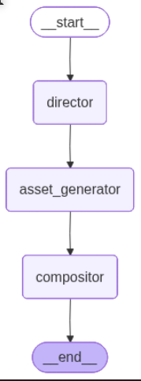

# Architecture Overview

The Cartoon Generator uses a modular agent-based architecture to create educational comics through AI orchestration.

## System Diagram

```
┌─────────────────┐    ┌──────────────────┐    ┌─────────────────┐
│   Gradio UI     │────│  Agent Orchestrator│────│   Email Service │
│                 │    │  (LangGraph)      │    │                 │
│ • User Input    │    │                   │    │ • Gmail SMTP     │
│ • Progress Logs │    │ • Director Node   │    │ • HTML Attach    │
│ • Download      │    │ • Asset Gen Node  │    └─────────────────┘
│ • Example View  │    │ • Compositor Node │
└─────────────────┘    └──────────────────┘
         │                       │
         └───────────────────────┼───────────────────────► HTML Comic
                                 │
                    ┌────────────▼────────────┐
                    │    Gemini API           │
                    │                         │
                    │ • Script Generation     │
                    │ • SVG Character Creation│
                    │ • HTML Composition      │
                    └─────────────────────────┘
```

## Components

### 1. User Interface (Gradio)
- **Purpose**: Web-based interface for comic generation
- **Features**: 
  - Email input collection
  - Idea description textarea
  - Optional PDF upload
  - Real-time progress display
  - Download functionality
  - Example comic preview
- **Styling**: Kid-friendly with animations and emojis

### 2. Agent Core (LangGraph)
- **Planner/Director**: Analyzes user input and creates 3-panel comic script using structured JSON
- **Executor/Asset Generator**: Creates SVG characters for each unique character in the script
- **Compositor**: Assembles final HTML with backgrounds, character positioning, and dialogue bubbles
- **Memory**: Maintains script state and character assets across nodes (no persistent storage)

### 3. Tools / APIs
- **Google Gemini 2.5 Flash**: Primary LLM for creative content generation
  - Script writing with JSON structured output
  - SVG code generation for characters
  - HTML composition and styling
- **Gmail SMTP**: Email delivery system for comic attachments
- **ReportLab (backup)**: PDF generation capability
- **PyPDF**: PDF text extraction for additional context

### 4. Observability
- **Console Logging**: Real-time progress tracking with emojis
  - Director node start/completion
  - Asset generation per character
  - Compositor assembly
  - Email sending status
- **UI Logs**: Captured subprocess output displayed in Gradio textarea
- **Error Handling**: Try/catch blocks with detailed error messages
- **Progress Indicators**: Visual feedback during generation process

## LangGraph Workflow Visualization

The system uses LangGraph to orchestrate a 3-node agent workflow. Below is the actual graph visualization generated by the system:



### Graph Explanation
- **Director Node (Planning)**: Entry point that analyzes user input and generates structured JSON comic scripts
- **Asset Generator Node (Execution)**: Processes each character from the script, creates SVG art, and converts to PNG
- **Compositor Node (Assembly)**: Combines all assets into final HTML comic with base64-embedded images
- **Flow**: Director → Asset Generator → Compositor → END
- **State Management**: Pydantic models ensure type-safe data flow between nodes
- **Error Handling**: Automatic retries and fallback mechanisms at each step

This graph represents the core agentic intelligence - breaking down comic creation into specialized, sequential steps that leverage AI for creative content generation while maintaining structured data flow and observability.
