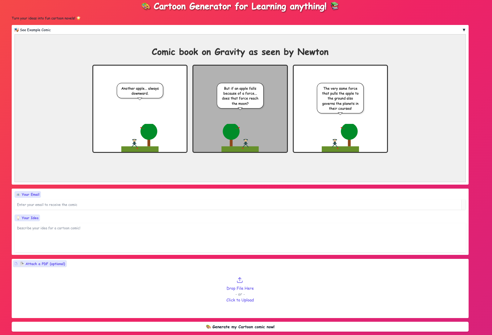
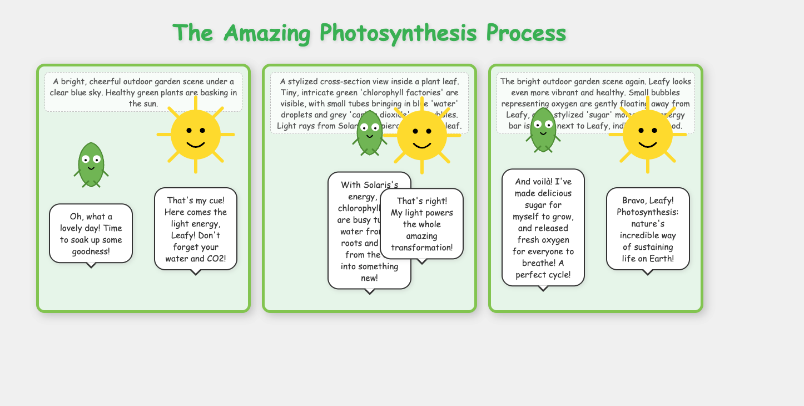
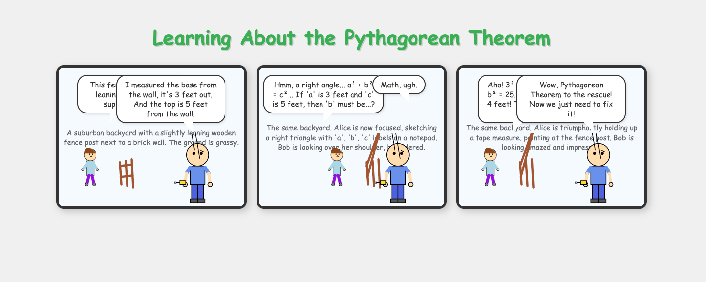

# Cartoon Generator for Learning Anything

Welcome to **Cartoon Generator for Learning Anything**! This innovative app uses AI-powered agents to create educational cartoon comics that make learning fun and engaging for kids and adults alike.

## 🎯 What It Does

- **AI-Generated Comics**: Input any topic or idea, and our agent creates a custom 3-panel cartoon comic explaining it
- **Educational Focus**: Turns complex concepts into visual, story-driven learning experiences
- **Interactive UI**: Kid-friendly Gradio interface with real-time progress tracking
- **Email Delivery**: Comics sent directly to your inbox as HTML attachments
- **Download Option**: Direct download of generated comics

## 🚀 Features

- 🤖 **LangGraph Agent**: Orchestrates comic creation with Director, Asset Generator, and Compositor nodes
- 🎨 **Gemini Integration**: Uses Google Gemini 2.5 Flash for creative script writing and SVG generation
- 📧 **Email System**: Automated delivery using Gmail SMTP
- 🌈 **Kid-Friendly UI**: Cartoonish design with animations and emojis
- 📖 **Example Comics**: Built-in preview of generated content

## 📋 Setup Instructions

### Prerequisites
- Python 3.10+
- Google Gemini API key (get from [Google AI Studio](https://makersuite.google.com/app/apikey))

### Installation

1. **Clone the repository**:
   ```bash
   git clone <repository-url>
   cd Rogue-Agents
   ```

2. **Install dependencies**:
   ```bash
   pip install -r requirements.txt
   ```

3. **Set up environment variables**:
   - Copy `.env.example` to `.env` (or create `.env`)
   - Add your API keys:
     ```
     GOOGLE_API_KEY=your_gemini_api_key_here
     senderEmail=your_sender_email@gmail.com
     senderPassword="your_gmail_app_password"
     ```
     **Note:** If your Gmail app password contains spaces, wrap it in quotes as shown above.

4. **Run the app**:
   ```bash
   python src/gradio_chatbot.py
   ```

5. **Access the interface**:
   - Open http://0.0.0.0:7660 in your browser
   - Or use the public Gradio share link

### Dependencies

Key packages in `requirements.txt`:
- `gradio` - Web interface
- `langchain-google-genai` - Gemini integration
- `langgraph` - Agent orchestration
- `pydantic` - Data validation
- `reportlab` - PDF generation (backup)
- `pypdf` - PDF text extraction

## 🏗️ Architecture

The app consists of:
- **Frontend**: Gradio web interface with cartoonish styling
- **Backend Agent**: LangGraph workflow with 3 specialized nodes
- **Email Service**: Gmail SMTP for comic delivery
- **Asset Generation**: SVG-based character creation

## 📖 Usage

1. Enter your email address
2. Describe the topic/idea for the comic
3. Optionally attach a PDF for additional context
4. Click "Generate my Cartoon comic now!"
5. Watch real-time progress logs
6. Receive comic via email and download directly

## 🎨 Example Comics

Here are some example comics generated by the app:

### Newton's Law of Gravity

*Example comic explaining Newton's law of gravity through a conversation between Newton and a student*

### Photosynthesis Process

*Educational comic explaining how plants convert sunlight into energy*

### Pythagorean Theorem

*Fun visual explanation of the Pythagorean theorem with triangles and cats*

These examples demonstrate how complex educational topics are transformed into engaging, memorable visual stories. The AI agent creates custom characters, dialogue, and backgrounds for each topic!

**Note:** Screenshots will be added to the `images/` folder during final submission.

## 🏅 Judging Criteria Alignment

- **Technical Excellence**: Robust LangGraph agent with error handling and logging
- **Architecture & Documentation**: Clean separation of concerns, comprehensive docs
- **Gemini Integration**: Creative use of Gemini for multi-step comic generation
- **Societal Impact**: Makes education accessible and fun through visual storytelling
